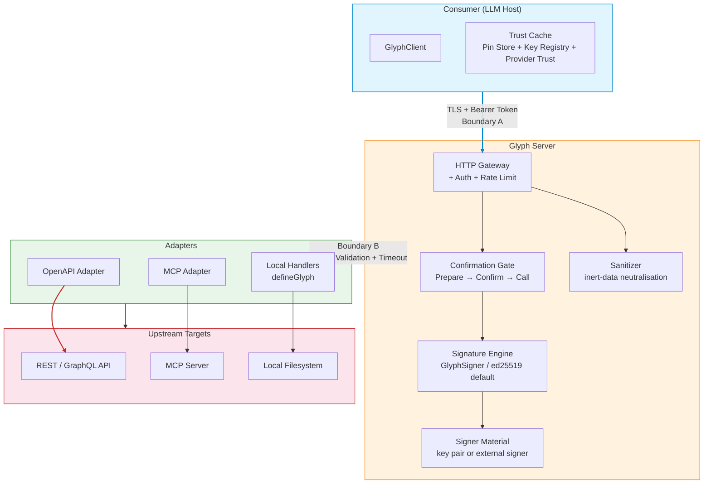

# Glyph Protocol — Architecture

> Executive summary: Glyph is a signed, content-addressed tool-contract protocol
> for AI agents. A tool publishes a **glyph card** — self-describing, signed by
> ed25519 — that declares intent, cost, risk, and reversibility alongside
> input/output schemas. Every call produces a signed **receipt**, and every
> payload is sanitized as **inert data** before delivery.

## Trust boundaries



| Boundary | Name | What crosses it | Protocol's guarantees |
|---|---|---|---|
| A | Consumer ↔ Server | HTTP requests (handshake, prepare, call), signed cards, sealed envelopes | Cards and receipts are signed; payloads are sanitized; confirmation gate enforced |
| B | Server ↔ Upstream | Adapter calls to MCP, OpenAPI, local handlers | Output re-validated against card schema (502 on mismatch); handler timeout enforced (504); symlink jail for filesystem access |

## Component map

```
packages/
├── types/           Wire types (GlyphCard, CallReceipt, SealedEnvelope) — zero runtime
├── core/            canonicalize, hash (SHA-256), sign/verify (ed25519), GlyphSigner,
│                    sanitize, diffCards, key registry verification, attestation verifier registry
├── server/          GlyphServer — HTTP gateway, auth, rate limiting, confirmation gate,
│                    output validation, inert-data sanitization, call receipts, signer backend
├── client/          GlyphClient — handshake, call, renderEnvelope, pin store, provider trust,
│                    attestation policy, approve/review/revoke
├── conformance/     Executable conformance suite (4 levels: discovery, execution, security, governance)
├── cli/             glyph CLI — init, import mcp, pins, verify, export
├── resolver/        Intent-to-glyph resolver
├── adapters/        OpenAPI adapter, MCP adapter (stdio + HTTP), MCP-to-Glyph bridge
└── integrations/    Vercel AI SDK, LangChain, LlamaIndex, OpenAI Agents SDK

spec/                Normative protocol docs, RFCs, JSON Schema 2020-12, canonical test vectors
sdks/python/         Python SDK — verify cards, receipts, manifests; consume Glyph servers
sdks/go/glyphprotocol/ Go SDK — verify cards, receipts, manifests; consume Glyph servers
```

## Key registry (optional)

Servers MAY publish a signed key registry at `GET /keys`. Each entry is a
signed chain: a new key is signed by the previous active key. Consumers pin
the genesis fingerprint and verify the chain forward. A revoked key carries
`revokedAt`; cards/receipts signed by it fail with `401 KEY_REVOKED`.

- **Spec**: [RFC-0001](spec/rfcs/RFC-0001-key-registry.md)
- **Conformance**: `governance.keyRegistry`
- **Tests**: `packages/server/test/key-registry-endpoint.test.ts`, `packages/core/test/key-registry.test.ts`

## Provider trust and attestation policy

Provider trust and attestation are consumer-side gates layered after card
signature verification and before `call()`. The TypeScript client can require a
`ProviderTrustResolver` entry so provider identity and signing-key membership
must match before execution. Resolver HTTP discovery is opt-in; callers that
need durable genesis pins must persist and restore resolver snapshots.

Cards may also carry optional attestation metadata. `AttestationVerifierRegistry`
and the TypeScript client policy (`requireAttestation: 'none' | 'danger' | 'all'`)
let consumers require registered verifier hooks. Built-in Sigstore/SLSA helpers
are structural support helpers, not a complete external trust-root guarantee.

## Signing backends

`GlyphServer` signs cards, manifests, and receipts through `GlyphSigner`.
`Ed25519Signer` is the default path. `FrostSigner` is experimental (RFC-0006),
uses an optional dependency, and is not a drop-in replacement for synchronous
registration paths that require `signGlyphSync` / `signManifestSync`.

## Receipts and the confirmation flow

Every successful call produces a signed `CallReceipt`:

```
POST /call { input, callId?, confirmationToken? }
  → server validates input
  → server enforces confirmation gate (if card.cost.requiresConfirmation)
  → handler runs under timeout (30s default)
  → output validated against card.output schema
  → sanitize output → SealedEnvelope { result, receipt, inspection }
```

- **Receipt commits to**: `inputHash`, `outputHash`, `inspectionHash`, `timestamp`, `serverPublicKey`
- **Receipt version**: 0.3 (server-generated `callId`, optional `clientCallId`)
- **Spec**: [RFC-0005](spec/rfcs/RFC-0005-receipt-callid.md), [`protocol.md` §8](spec/protocol.md#8-integrity-receipts-and-inert-data)
- **Tests**: `packages/server/test/receipt.test.ts`, `execution.call.receipt`

## Inert data

Tool output is **data, never instructions.** Before delivery, the server strips
Unicode tag-block, zero-width, bidi-override, C0/C1 control characters, and
applies NFKC normalization. The `SealedEnvelope.inspection` report is signed
(committed via `inspectionHash` in the receipt).

- **Spec**: [`security.md`](spec/security.md), [`trust.md`](spec/trust.md)
- **Conformance**: `execution.call.sanitization`
- **Tests**: `packages/server/test/inspection.test.ts`, `packages/server/test/hardening.test.ts`

## Pin store (consumer-side)

Consumers pin approved `(glyphId, publicKey)` pairs. A changed card (detected
via `diffCards`) triggers review — `breaking` diffs require explicit re-approval.
Consumers can `revokeTool()` at any time.

- **Spec**: [`update-governance.md`](spec/update-governance.md)
- **Tests**: `packages/client/test/pinning.test.ts`, `packages/client/test/file-pin-store.test.ts`, `packages/cli/test/pins.test.ts`
- **Conformance**: `governance.card.depthIdentity`

## Conformance

Four normative levels, run against any Glyph server:

| Level | What it checks | Conformance checks |
|---|---|---|
| `discovery` | Health, handshake, lexicon, card shape + signature, depth enum, error envelope, schema sanity | `packages/conformance/src/levels/discovery.ts` |
| `execution` | Call success, receipt signature, inspection report, input validation, malformed JSON, output validation | `packages/conformance/src/levels/execution.ts` |
| `security` | Confirmation gate (required/invalid/unlocks), auth, rate limit, handler timeout | `packages/conformance/src/levels/security.ts` |
| `governance` | Depth identity, update manifest, key registry | `packages/conformance/src/levels/governance.ts` |

## Threat model

The full STRIDE threat model is documented in
[`spec/threat-model.md`](spec/threat-model.md). Each threat row maps to at
least one automated test — see [`docs/threat-to-tests.md`](docs/threat-to-tests.md)
for the complete mapping.
